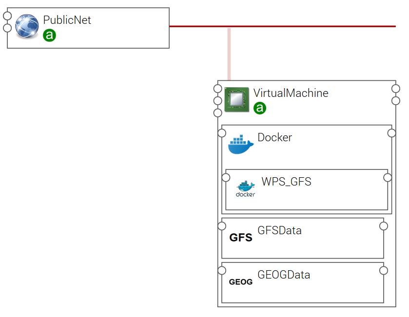
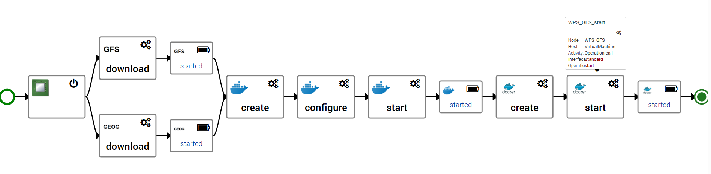

# RISICO application

First draft for RISICO application template implementing for now only the pre-processing step.
The graphical view of the application template shows the following components hosted
on a compute instance:

* GEOGData component, responsible for download geographical files from a web site
* GFSData component, responsible for download Global Forecast System files from a web site
* Docker, to run container
* WFS_GFS container performing the pre-processing (see [CIMA WPS model](https://github.com/cima-lexis/wps.docker))

The associated workflow created first a Virtual Machine.
Then downloads in parallel GFS and geographical data files.
Docker is then installed on the Virtual Machine and the WPS GPS pre-processing container is run.

